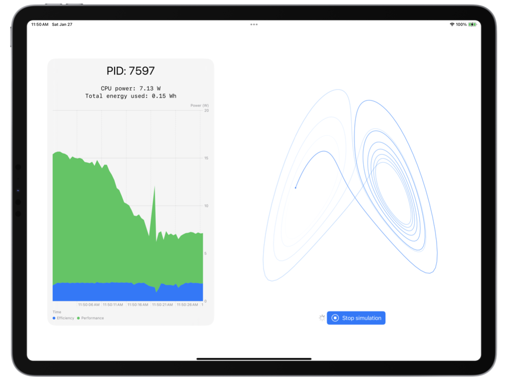

#  TestAppPower

A sample app demoing how to use `task_threads` and `proc_pidinfo` to retrieve realtime information on CPU energy consumption, paired with a compute-heavy simulation to test the effects of increasing CPU usage.

## How does it work?

All the code related to energy measurements is under TestAppPower/PowerWidget. It works by using `libroc`'s `proc_pidinfo` with the new `PROC_PIDTHREADCOUNTS` option, which returns a `struct` including per-thread energy measurements from CPU counters. The list of all threads is retrieved using `task_threads` with the PID of the current task (root privileges are required to invoke `task_threads` on other processes).

The `libproc.h` headers can't be imported on iOS, so they're reproduced at the beginning of `sample_threads.c`, as well as the result `struct`s from the `proc_pidinfo`, using the definitions and documentation available in [Apple's OSS Distributions repository for `libproc.h`](https://github.com/apple-oss-distributions/xnu/blob/aca3beaa3dfbd42498b42c5e5ce20a938e6554e5/bsd/sys/proc_info.h).

## Limitations

Since without root privileges only the energy of the threads from the same process can be measured, APIs that trigger work on a kernel thread (ie system calls) won't be accounted for in the power metrics of the app.

## Compatibility

Requires an A15 Bionic or newer CPU.
